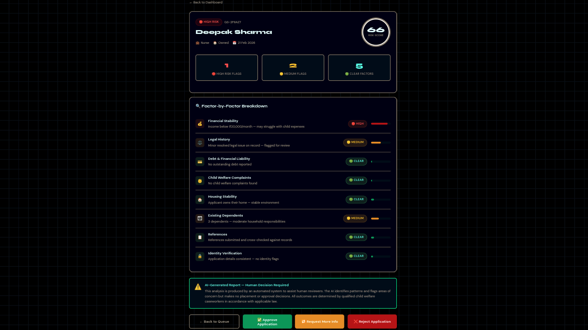
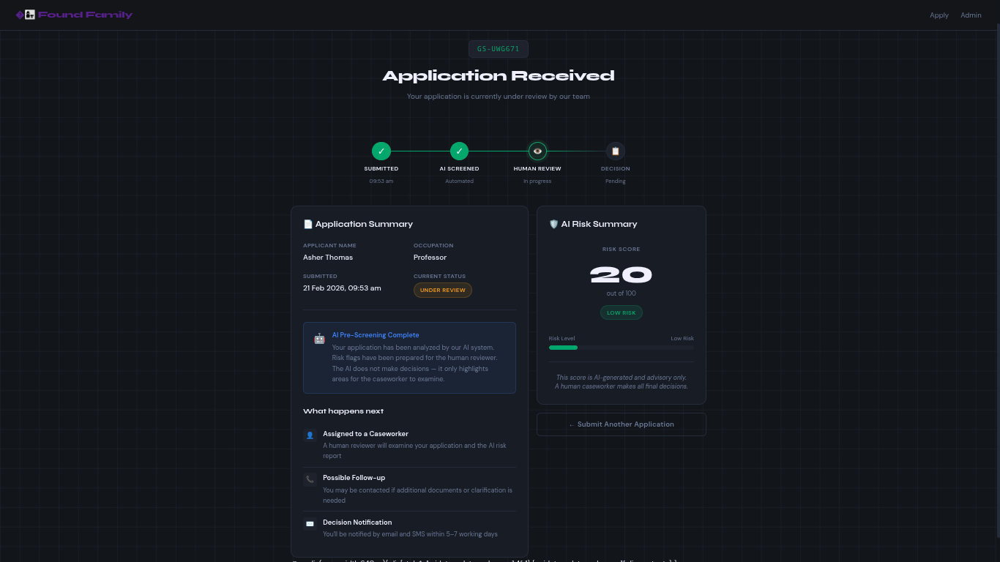
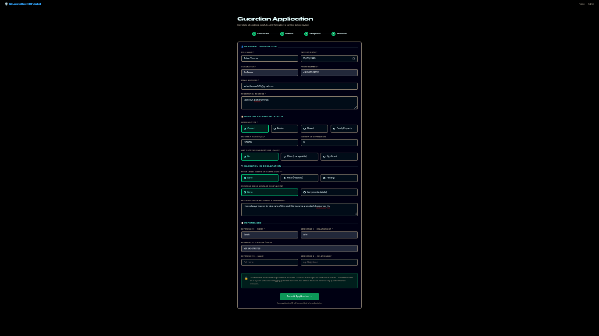
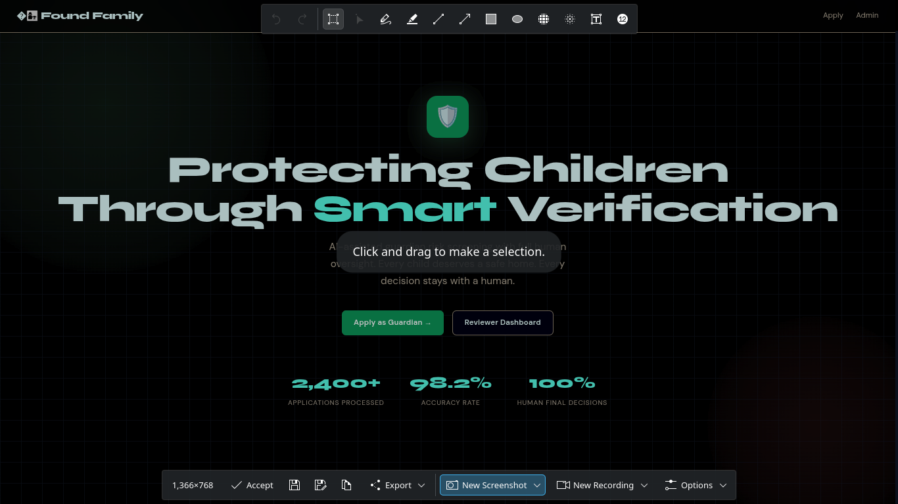

# Found Family — Child Safety Platform

A secure, AI-assisted guardian risk screening platform with full human oversight. Built with Flask, Google Generative AI, and SQLAlchemy for child welfare organizations.

---

## 📋 Project Description

**Found Family** is a web-based platform that helps child welfare organizations assess guardian applications and match children with suitable guardians. The system uses AI to flag potential risks and provide data-driven insights, but **all final decisions remain with human caseworkers**.

**Key Principle:** AI assists, humans decide. Every child deserves a safe home.

- **Risk Assessment Module**: Analyzes guardian applications against 10+ risk factors (financial stability, housing, legal history, health status, etc.)
- **Matching Engine**: Finds compatible guardian-child pairings based on lifestyle, special needs, and compatibility scores
- **Reviewer Dashboard**: Caseworker panel with filterable queue, approval/rejection workflows, and demo data
- **Secure Architecture**: Environment-based secrets, lazy-loaded AI SDK, production-ready deployment

---

## 🛠️ Tech Stack

| Component | Technology | Version |
|-----------|-----------|---------|
| Backend Framework | Flask | 2.3.3 |
| Database ORM | Flask-SQLAlchemy | 3.0.5 |
| CORS Middleware | Flask-CORS | 4.0.0 |
| AI / LLM SDK | google-generativeai | 0.7.1 |
| Protocol Buffers | protobuf | 4.25.3 |
| Environment Config | python-dotenv | 1.0.0 |
| Python Runtime | Python | 3.11 (Render) / 3.12+ (local dev) |
| Web Server (Production) | gunicorn | 20.1.0 |
| Frontend | HTML5 + CSS3 + Vanilla JS | — |
| Database (Dev) | SQLite | — |
| Database (Prod) | PostgreSQL (recommended) | — |
| Deployment | Render | — |
| Version Control | Git / GitHub | — |

---

## ✨ Features

### Core Features
- ✅ **Guardian Application Intake** — Multi-section form collecting personal, financial, background, and reference data
- ✅ **AI-Powered Risk Assessment** — Gemini API analyzes applications; returns risk score (0–100), level (low/medium/high), and detailed reasoning
- ✅ **Child-Guardian Matching** — AI recommends compatible matches based on age, lifestyle, special needs, and housing
- ✅ **Reviewer Dashboard** — Caseworker interface with:
  - Real-time stats (total, pending, high-risk, approved)
  - Filterable queue (all / pending / high-risk / approved / rejected)
  - Search by applicant name
  - One-click approve/reject decisions
- ✅ **Data Persistence** — SQLAlchemy ORM with SQLite (dev) / PostgreSQL (prod)
- ✅ **RESTful API** — JSON endpoints for applications, risk assessments, and matches
- ✅ **Static File Serving** — Frontend (HTML, CSS) served from Flask with SPA fallback
- ✅ **Health Check Endpoint** — `/api/health` for deployment monitoring

### Security Features
- ✅ **Environment Variable Secrets** — API keys, DB URLs, secrets via `.env` (never committed)
- ✅ **Lazy-Loading AI SDK** — Defers import until runtime; avoids early protobuf conflicts
- ✅ **CORS Configuration** — Restrictable by origin; defaults to permissive for dev
- ✅ **Production Server** — gunicorn instead of Flask dev server
- ✅ **Python 3.11 Lock** — Avoids Python 3.14 protobuf metaclass errors

---

## 📦 Installation

### Prerequisites
- **Python 3.11+** (3.11 required for Render; 3.12+ supported locally)
- **pip** (included with Python)
- **Git** (for cloning repo)
- **Google API Key** with Generative AI enabled

### Step 1: Clone Repository
```bash
git clone https://github.com/simisimon07/found-family.git
cd found-family
```

### Step 2: Create Virtual Environment
```bash
python -m venv .venv
source .venv/bin/activate  # On Windows: .venv\Scripts\activate
```

### Step 3: Install Dependencies
```bash
pip install -r requirements.txt
```

### Step 4: Set Up Environment Variables
```bash
cp .env.example .env
```

Edit `.env` and fill in:
```env
GEMINI_API_KEY=your_google_api_key_here
SECRET_KEY=your_secure_random_key_here
FLASK_ENV=development
DATABASE_URL=sqlite:///guardian_shield.db
PORT=5000
```

### Step 5: Initialize Database
```bash
python -c "from app import app; from models import db; 
with app.app_context(): db.create_all()"
```

### Step 6: Run Locally
```bash
python app.py
# or with gunicorn (production-like):
gunicorn wsui:app --bind 0.0.0.0:5000 --workers 1
```

Open browser: **http://localhost:5000**

---

## 🚀 Usage Examples

### Example 1: Submit a Guardian Application via Web Form
1. Navigate to http://localhost:5000/apply.html
2. Fill in Personal Information (name, DOB, occupation, email, phone, address)
3. Enter Housing & Financial Status (type, income, dependents, debt level)
4. Disclose Legal/Background History (legal issues, criminal record, welfare history)
5. Add References (2 people who can vouch for you)
6. Click **Submit** → Application stored in DB; AI risk assessment triggered automatically

**Expected output:** Application appears in reviewer dashboard with AI-generated risk score (e.g., "Risk Score: 42 | Level: Medium")

---

### Example 2: Review Applications in Dashboard
1. Navigate to http://localhost:5000/dashboard.html
2. View stats card: "2 pending reviews, 1 high-risk flagged"
3. Click **High Risk** filter to see applications with score ≥ 65
4. Select an application → see detailed risk factors, protective factors, AI assessment
5. Click **Approve** or **Reject** → decision logged; status updated

**Expected output:**
```
Application: Arun Patel | Risk: 89 (HIGH) ⚠️
Risk Factors: Minor legal issue, significant debt, shared housing
Protective Factors: None significant
AI Assessment: "Applicant shows multiple red flags. Financial instability and pending legal matter raise concerns about ability to provide stable care for children."
```

---

### Example 3: Call Risk Assessment API Directly
```bash
curl -X POST http://localhost:5000/api/applications/assess_risk \
  -H "Content-Type: application/json" \
  -d '{
    "name": "Priya Sharma",
    "age": 35,
    "occupation": "Teacher",
    "annual_income": 48000,
    "income_stability": "stable",
    "housing_type": "owned",
    "dependents": 1,
    "debt_level": "no",
    "legal_issues": "none",
    "criminal_record": "clean",
    "welfare_history": "none",
    "health_status": "good"
  }'
```

**Expected response:**
```json
{
  "success": true,
  "risk_score": 22,
  "risk_level": "low",
  "risk_factors": ["minor age gap with oldest child"],
  "protective_factors": ["stable income", "owned housing", "education background"],
  "ai_assessment": "Strong candidate with few risk factors. Teaching background suggests capability for child care and education support.",
  "recommendations": "Proceed with standard background verification and reference checks.",
  "confidence_score": 0.92
}
```

---

### Example 4: Get Matching Recommendations
```bash
curl -X POST http://localhost:5000/api/applications/find_matches \
  -H "Content-Type: application/json" \
  -d '{
    "application_id": "APP-001",
    "available_children": [
      {
        "id": "CHILD-001",
        "name": "Arjun",
        "age": 8,
        "gender": "M",
        "interests": "cricket, science",
        "special_needs": "mild asthma",
        "requires_experienced_guardian": false
      },
      {
        "id": "CHILD-002",
        "name": "Pia",
        "age": 12,
        "gender": "F",
        "interests": "art, music",
        "special_needs": "none",
        "requires_experienced_guardian": false
      }
    ]
  }'
```

**Expected response:**
```json
{
  "success": true,
  "matches": [
    {
      "child_id": "CHILD-002",
      "compatibility_score": 87.5,
      "match_reasoning": "Age-appropriate pairing. Applicant's education background aligns with child's artistic interests; lifestyle match on housing and income stability.",
      "potential_challenges": "None identified.",
      "recommendations": "Recommend pairing. Arrange meet-and-greet before final placement."
    },
    {
      "child_id": "CHILD-001",
      "compatibility_score": 76.0,
      "match_reasoning": "Good baseline match. Applicant has experience with children; income sufficient for additional medical expenses (asthma).",
      "potential_challenges": "Age gap may require attention to developmental needs.",
      "recommendations": "Good option. Confirm applicant comfort with medical care needs."
    }
  ],
  "overall_assessment": "Applicant is well-suited for both children. Recommend interviews before placement."
}
```

---

## 🔧 API Command Reference

### Applications

#### **POST** `/api/applications` — Create Application
```bash
curl -X POST http://localhost:5000/api/applications \
  -H "Content-Type: application/json" \
  -d '{"name":"Example", "email":"test@example.com", ...}'
```
**Response:** `{ "success": true, "application_id": "APP-123", "data": {...} }`

#### **GET** `/api/applications/<app_id>` — Get Specific Application
```bash
curl http://localhost:5000/api/applications/APP-123
```
**Response:** `{ "success": true, "data": {...} }`

#### **GET** `/api/applications` — List All Applications
```bash
curl http://localhost:5000/api/applications?status=pending&limit=10
```
**Query Params:** `status`, `limit`, `offset`  
**Response:** `{ "success": true, "applications": [...], "total": 42 }`

#### **PATCH** `/api/applications/<app_id>` — Update Application Status
```bash
curl -X PATCH http://localhost:5000/api/applications/APP-123 \
  -H "Content-Type: application/json" \
  -d '{"status": "approved"}'
```
**Response:** `{ "success": true, "message": "Application updated", "data": {...} }`

### Risk Assessment

#### **POST** `/api/risk-assessment` — Assess Single Application
```bash
curl -X POST http://localhost:5000/api/risk-assessment \
  -H "Content-Type: application/json" \
  -d '{...application_data...}'
```
**Response:** `{ "success": true, "risk_score": 42, "risk_level": "medium", "ai_assessment": "...", ... }`

### Matching

#### **POST** `/api/children/find_matches` — Find Matches for Children
```bash
curl -X POST http://localhost:5000/api/children/find_matches \
  -H "Content-Type: application/json" \
  -d '{"application_data": {...}, "available_children": [...]}'
```
**Response:** `{ "success": true, "matches": [{...}, ...], "overall_assessment": "..." }`

### Health / Status

#### **GET** `/api/health` — Health Check
```bash
curl http://localhost:5000/api/health
```
**Response:** `{ "success": true, "status": "API is running", "timestamp": "2026-02-21T..." }`

---

## 📊 Demo Output

### Application Submission Flow
```
INPUT (User fills form):
Name: Meera Nair
Age: 42
Occupation: School Principal
Income: ₹75,000/month
Housing: Owned
Dependents: 1
Legal Issues: None
Criminal Record: None
Wellness History: None

↓ Flask receives POST to /api/applications
↓ AI (Gemini) analyzes data
↓ Risk factors computed; protective factors identified

OUTPUT (Dashboard shows):
┌─────────────────────────────────────────────┐
│ Meera Nair | APP-GS-0542                    │
│ Risk Score: 18 (LOW) ✓                      │
│ Status: ⏳ Pending Review                    │
├─────────────────────────────────────────────┤
│ Risk Factors: None significant              │
│ Protective Factors:                         │
│  • Stable income (₹75k/month)               │
│  • Owned housing                            │
│  • Education background (Principal)         │
│  • No legal/criminal history                │
├─────────────────────────────────────────────┤
│ AI Assessment:                              │
│ "Strong candidate. Financial stability,    │
│  stable housing, and education background   │
│  suggest excellent capability for child    │
│  care and development support."             │
├─────────────────────────────────────────────┤
│ [✅ APPROVE]  [❌ REJECT]                   │
└─────────────────────────────────────────────┘
```

### Match Recommendation Output
```
INPUT (Caseworker searches for matches):
Applicant: Meera Nair (Risk: Low, Score: 18)
Available Children: 
  1. Arjun (M, 8y) — cricket, science, mild asthma
  2. Pia (F, 12y) — art, music, no special needs

↓ AI (Gemini) analyzes compatibility

OUTPUT (Dashboard shows ranked matches):
┌────────────────────────────────────────┐
│ MATCH RECOMMENDATIONS FOR MEERA NAIR   │
├────────────────────────────────────────┤
│ 1. Pia (F, 12) — Compatibility: 92%   │
│    "Principal background aligns well   │
│     with Pia's artistic interests.     │
│     Stable income supports music      │
│     lessons and art supplies. Highly  │
│     recommended."                      │
│                                        │
│ 2. Arjun (M, 8) — Compatibility: 78%  │
│    "Good match. Teaching experience   │
│     supports education. Can manage    │
│     asthma care. Recommend."          │
│                                        │
│ [👁️ INTERVIEW ARJUN]                  │
│ [👁️ INTERVIEW PIA]                    │
└────────────────────────────────────────┘
```

---

## 👥 Team Members

| Role | Name | Contact |
|------|------|---------|
| Founder & Lead Developer | Simisimon07 | [GitHub](https://github.com/simisimon07) |
| DevOps & Backend Setup | Copilot AI | — |

---

## 📜 License Info

This project is licensed under the **MIT License**. See [LICENSE](LICENSE) file for details.

### License Summary
- ✅ **Use:** Personal, commercial, and educational use permitted
- ✅ **Modify:** Allowed; modifications must retain copyright/license notice
- ✅ **Distribute:** Allowed under same license
- ❌ **Liability:** No warranty; author not liable for damages
- ⚠️ **Attribution:** Retain license + copyright notice in distributions

---

## 🚀 Deployment

### Deploy to Render (Recommended)
1. Push to GitHub
2. Create new Web Service on [Render.com](https://render.com)
3. Connect your repo
4. Set environment variables: `GEMINI_API_KEY`, `SECRET_KEY`, `DATABASE_URL`
5. Render auto-detects `runtime.txt` (Python 3.11) and `Procfile` (gunicorn startup)
6. Deploy → Live at `https://<your-app>.onrender.com`

For detailed steps, see [RENDER_DEPLOYMENT_CHECKLIST.md](RENDER_DEPLOYMENT_CHECKLIST.md)

### Deploy to Vercel (Static Frontend Only)
See [DEPLOYMENT_CONFIG.md](DEPLOYMENT_CONFIG.md) for Vercel backend + separate frontend hosting.

---

## 🐛 Troubleshooting

### Port Already in Use
```bash
# Kill process using port 5000
lsof -i :5000
kill -9 <PID>

# Or run on different port
PORT=8000 python app.py
```

### CSS Not Loading
- Hard refresh browser: **Ctrl+F5**
- Check DevTools → Network → verify `styles.css` returns 200
- Confirm Flask is serving `static/` folder correctly

### API Key Error: "GEMINI_API_KEY not set"
- Create `.env` file: `cp .env.example .env`
- Get key from [Google AI Studio](https://aistudio.google.com/app/apikey)
- Add to `.env`: `GEMINI_API_KEY=your_key_here`
- Restart Flask app

### Database Lock (SQLite)
- Delete `instance/guardian_shield.db`
- Reinitialize: `python -c "from app import app; from models import db; with app.app_context(): db.create_all()"`

---
## scrn shots 

   

##demo vedio
https://drive.google.com/drive/folders/1DKo5_080J5W7L23MJk6ieprygXIFE_3U?usp=drive_link
## 📚 Additional Resources

- [Flask Documentation](https://flask.palletsprojects.com/)
- [Google Generative AI Python SDK](https://ai.google.dev/tutorials/setup)
- [Render Deployment Docs](https://render.com/docs)
- [SQLAlchemy ORM](https://docs.sqlalchemy.org/)

---

## 📞 Support & Contributions

Found a bug? Have a suggestion? **Open an issue** or submit a **pull request** on [GitHub](https://github.com/simisimon07/found-family).

---

**Last Updated:** February 21, 2026  
**Maintained By:** [@simisimon07](https://github.com/simisimon07)

**maintained by :**sandra victor** 
**by tea code diggers**